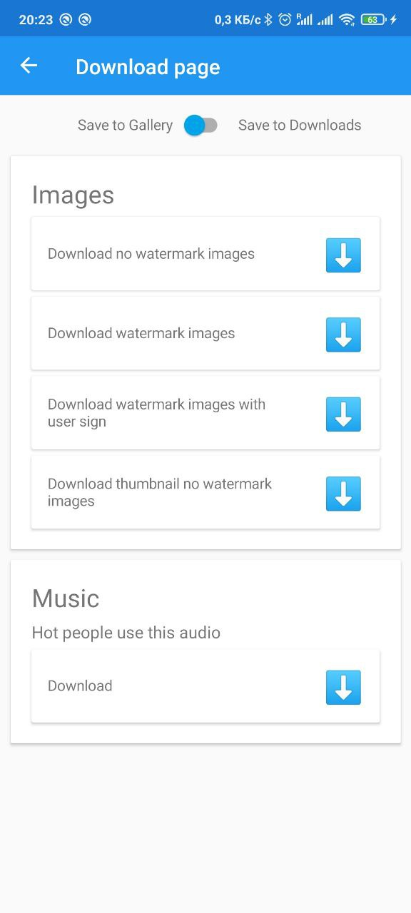

# TikTok downloader application
Xamarin.Forms Android Target Version 9.0

The application allows you to download and share watermark and no-watermark videos and images. It also allows you to separately download music from the video

## Download links:

* [GitHub](https://github.com/PavlenkoDR/TikTokDownloader/releases)
* [RuStore](https://apps.rustore.ru/app/com.PavlenkoDR.tiktokdownloader)

## App Screenshots

    
    
    

