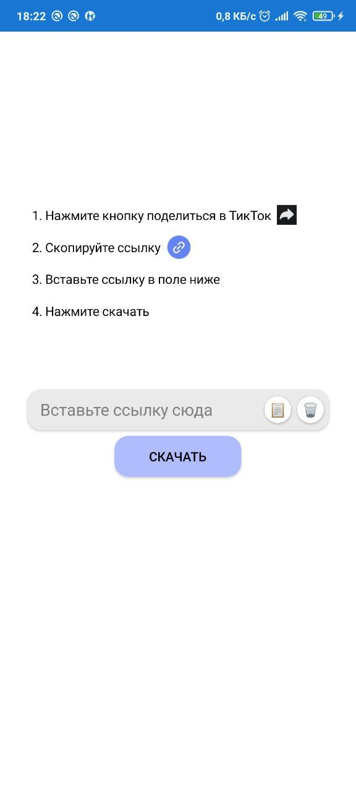
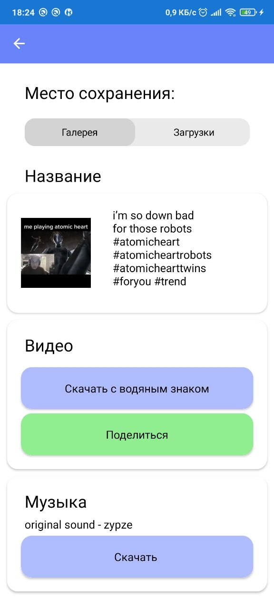

# TikTok downloader application
The application allows you to download and share watermark and no-watermark videos and images. It also allows you to separately download music from the video

[How to API 12 on Visual Studio 2019](https://github.com/xamarin/xamarin-android/wiki/JDK-11-Warning)

## Download links:

* [GitHub](https://github.com/PavlenkoDR/TikTokDownloader/releases)
* [Google Play](https://play.google.com/store/apps/details?id=com.PavlenkoDR.tiktokdownloader)
* [RuStore](https://apps.rustore.ru/app/com.PavlenkoDR.tiktokdownloader)

## App Screenshots

    
    
    

